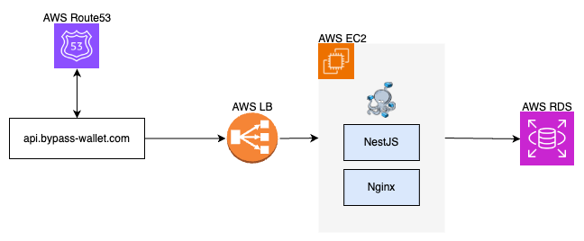

# Bypass

편리한 모임통장 관리를 위한 앱, 스쳐가는머니(Bypass)의 Backend 레포입니다.

## Description

- API Docs
    - https://api.bypass-wallet.com/api-docs

## Infra Structure



## Installation

```bash
$ pnpm install
```

## Running the app

```bash
# development
$ pnpm run start

# watch mode
$ pnpm run start:dev

# production mode
$ pnpm run start:prod
```

## Test

```bash
# unit tests
$ pnpm run test

# e2e tests
$ pnpm run test:e2e

# test coverage
$ pnpm run test:cov
```